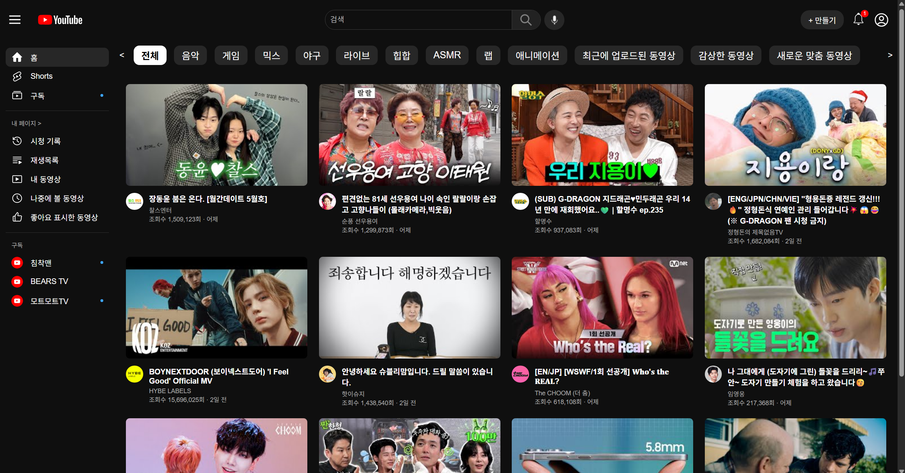
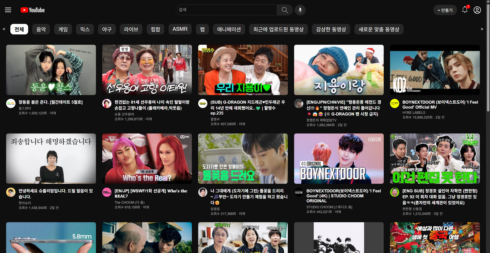
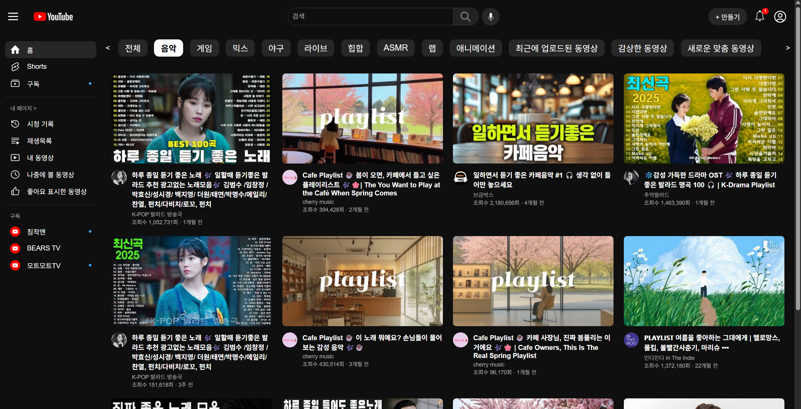
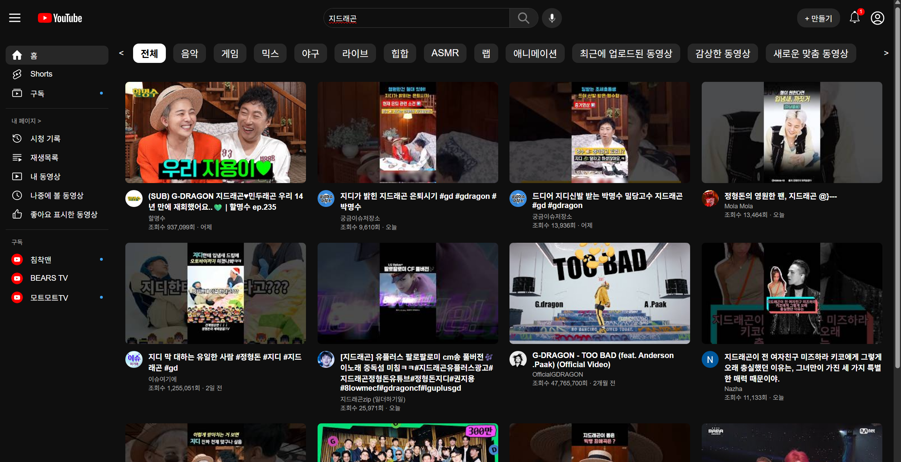
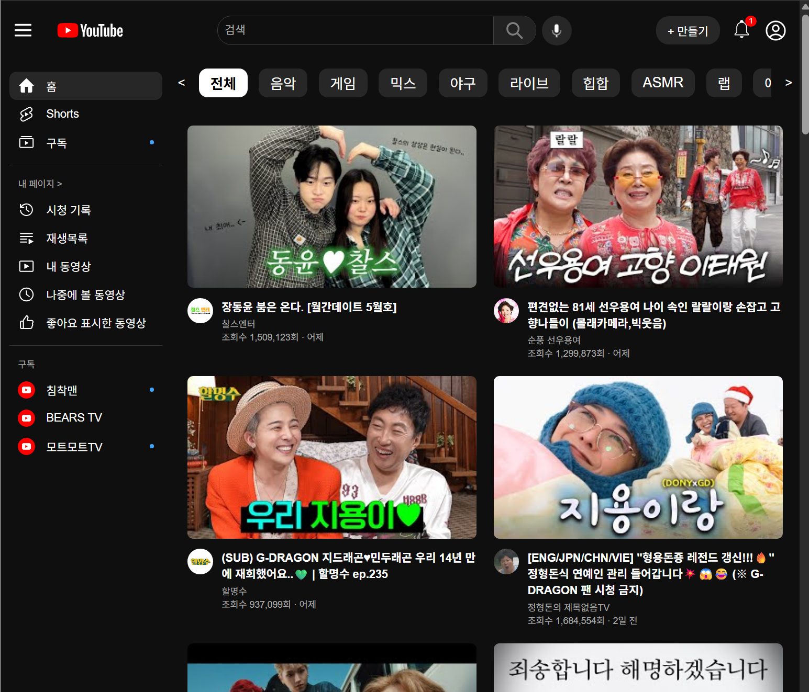
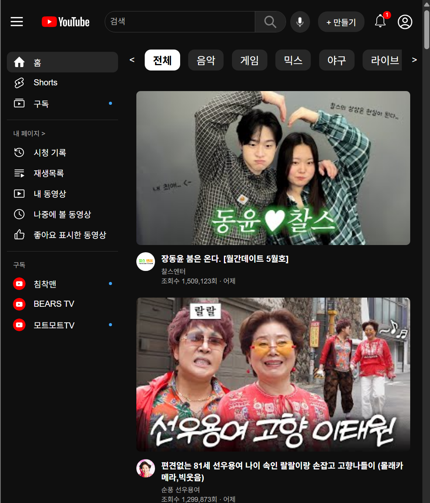

# EXP-MISSION-Youtube

---

### 사용 기술

- HTML, CSS, JavaScript
- YouTube Data API v3

---

### 구현 기능

- 인기 영상 불러오기
- 카테고리 / 키워드 기반 영상 검색
- 채널 썸네일 표시
- 조회수 및 날짜 포맷 표시
- 사이드바 토글 및 카테고리 슬라이더
- 검색 기능 및 로고 클릭 초기화

---
### 화면
> 전체화면

> 사이드바 닫았을 때 화면

> 음악 카테고리 화면

> 검색 결과 화면

> 반응형 화면

---

### index.html

구조 요소(세션) 설명
각 영역은 UI 역할에 따라 분리되었다.

| 요소      | 설명               | 요소                                                              |
| --------- | ------------------ | ----------------------------------------------------------------- |
| `header`  | 상단 헤더 영역     | 로고, 검색창, 업로드 버튼, 알림 아이콘, 유저 아이콘               |
| `sidebar` | 좌측 사이드바 영역 | 홈/Shorts/구독, 내 페이지, 구독 목록 등                           |
| `nav`     | 카테고리 영역      | 카테고리 탭 슬라이더 (좌우 이동 버튼 포함)                        |
| `Content` | 메인 콘텐츠 영역   | 인기 영상 및 검색 결과 카드들이 렌더링되는 공간 (.videoContainer) |

---

### CSS

- general.css : 전체 스타일
- header.css : 헤더 영역 스타일
- sidebar.css : 사이드바 스타일
- nav.css : 카테고리 영역 스타일
- video.css : 영상 카드 스타일

---

### Script.js

주요 기능별 함수 설명

| 함수명                             | 설명                                             |
| ---------------------------------- | ------------------------------------------------ |
| `loadPopularVideos()`              | 한국 인기 영상 30개를 가져와 화면에 렌더링       |
| `searchVideosByCategory(query)`    | 검색어 기반 영상 검색 및 상세 정보 조회          |
| `fetchChannelThumbnail(channelId)` | 채널 썸네일 이미지 URL을 반환                    |
| `renderVideoList(videos)`          | 받아온 영상 리스트를 HTML 요소로 렌더링          |
| `getRelativeDate(dateString)`      | 업로드 날짜를 'n일 전', 'n개월 전' 등으로 표시   |
| `setupCategoryButtons()`           | 카테고리 버튼에 클릭 이벤트 바인딩               |
| `Sidebar()`                        | 사이드바 열고 닫기 토글 기능                     |
| `navbtn()`                         | 카테고리 영역 좌우 슬라이딩 버튼 기능            |
| `setupSearchBar()`                 | 검색 버튼 및 엔터 입력 이벤트로 영상 검색 실행   |
| `setupLogoClick()`                 | 로고 클릭 시 카테고리 초기화 및 인기 영상 재로드 |
| `DOMContentLoaded 이벤트`          | 페이지 로딩 완료 시 초기 기능 실행               |
